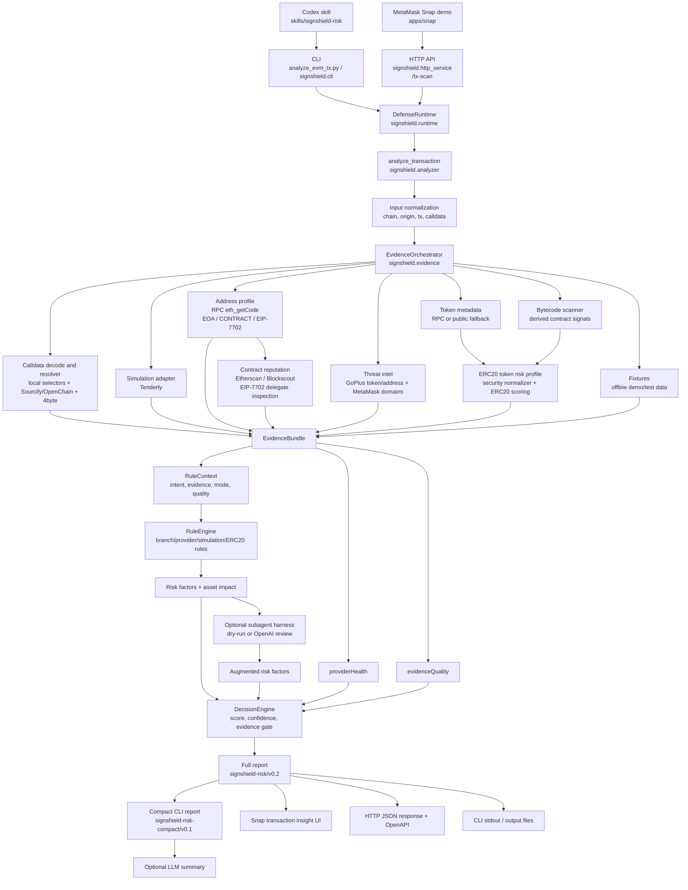

# TxRiskAgent

> SignShield-style EVM pre-signature transaction risk analyzer.

## Overview

TxRiskAgent helps web3 users evaluate the security of EVM transactions before they signs them.

The target scenario is pre-signature transaction risk scanning: receive a wallet transaction JSON object, decode its calldata, classify the user intent, enrich the facts with optional live security sources, score the risk, and return a structured report that can be shown in a wallet, API workflow, or review tool.

It currently focuses on:

- Native transfers, ERC20 approvals, ERC20 transfers, NFT approvals, multicalls, unknown contract calls, and unsupported non-EVM chains.
- ERC20 token risk profiling for owner privileges, honeypot/sell restrictions, tax controls, proxy/source transparency, bytecode signals, holder concentration, and LP lock facts when available.
- Live best-effort enrichment from calldata resolvers, simulation, contract reputation, threat intelligence, RPC metadata, and optional semantic subagent review.
- JSON reports plus Chinese plain-language summaries and recommendations for end users.

## Quick Start

Prerequisites:

- Python 3.11+
- `uv`

Start the HTTP service:

```bash
uv run uvicorn signshield.http_service:app --app-dir skills/signshield-risk/scripts --host localhost --port 8000
```


Scan one transaction over HTTP:

```powershell
Invoke-RestMethod -Method Post -Uri http://localhost:8000/tx-scan -ContentType application/json -Body (Get-Content dump-tx/2026-06-02T11-14-54-807Z-20571aef-0d9a-489d-b3e1-3b4aaf982fbd.json -Raw)
```

```bash
curl -X POST http://localhost:8000/tx-scan -H "Content-Type: application/json" -d @dump-tx/2026-06-02T11-14-54-807Z-20571aef-0d9a-489d-b3e1-3b4aaf982fbd.json
```

If `TX_RISK_API_KEY` is configured, callers must include `X-API-Key`:

```powershell
Invoke-RestMethod -Method Post -Uri http://localhost:8000/tx-scan -Headers @{"X-API-Key"=$env:TX_RISK_API_KEY} -ContentType application/json -Body (Get-Content dump-tx/2026-06-02T11-14-54-807Z-20571aef-0d9a-489d-b3e1-3b4aaf982fbd.json -Raw)
```

```bash
curl -X POST http://localhost:8000/tx-scan -H "Content-Type: application/json" -H "X-API-Key: $TX_RISK_API_KEY" -d @dump-tx/2026-06-02T11-14-54-807Z-20571aef-0d9a-489d-b3e1-3b4aaf982fbd.json
```

Run the CLI against local fixtures or a batch directory:

```bash
uv run python skills/signshield-risk/scripts/analyze_evm_tx.py dump-tx --output output/risk-reports
```

## Snap Demo and Frontend

The local Snap demo lives in:

```text
apps/snap/
```

Start the TxRiskAgent HTTP service first:

```bash
uv run uvicorn signshield.http_service:app --app-dir skills/signshield-risk/scripts --host localhost --port 8000
```

Then run the Snap and browser demo:

```bash
cd apps/snap
npm install
npm run build
npm run start
```

Local demo ports:

- TxRiskAgent API: `http://localhost:8000/tx-scan`
- Snap server: `http://localhost:8080`
- Demo site: `http://127.0.0.1:5173`

The Snap uses MetaMask transaction insight permissions to POST `{chainId, transactionOrigin, transaction}` to `/tx-scan` before signing. It renders `signshield-risk/v0.2` verdicts, summaries, recommendations, and top risk factors inside MetaMask.

The browser demo also previews the same `/tx-scan` response fields in its output panel before submitting a transaction. The UI includes a TxRisk endpoint selector for local dev vs remote prod, plus an ETH/BNB network selector for native transfer demos. The BSC USDT approval demo remains fixed to BNB Smart Chain.

## Configuration

`.env.example` documents the supported environment variables. Treat it as a reference file only: real API keys and provider tokens should be injected through your shell, process manager, or deployment platform. `.env` is gitignored; do not commit secrets.

HTTP service variables:

```bash
export TX_RISK_API_KEY=...
export SIGNSSHIELD_HTTP_MODE=production
export SIGNSSHIELD_PUBLIC_RPC_FALLBACK=true
export SIGNSSHIELD_CORS_ORIGINS=*
export SIGNSSHIELD_TIMEOUT=30
```

Live enrichment provider variables:

```bash
export TENDERLY_ACCOUNT_SLUG=...
export TENDERLY_PROJECT_SLUG=...
export TENDERLY_ACCESS_KEY=...
export ETHERSCAN_API_KEY=...
export BLOCKSCOUT_BASE_URL=...
export SIGNSSHIELD_RPC_URL=...
export GOPLUS_BASE_URL=https://api.gopluslabs.io
```

Optional subagent and summary variables:

```bash
export SIGNSSHIELD_SUBAGENT_COMMAND=...
export SIGNSSHIELD_OPENAI_MODEL=gpt-5.5
export SIGNSSHIELD_OPENAI_REASONING_EFFORT=medium
```

Runtime modes:

- `offline`: deterministic demo/test mode; local fixtures may create high-confidence risk factors.
- `live-best-effort`: queries configured live providers and preserves demo fixture behavior for compatibility.
- `production`: disables local fixture labels as high-confidence malicious evidence by default and applies evidence-quality gates to high-uncertainty transactions.

The HTTP service defaults to `production` mode. CLI default mode is offline unless `--live` or `--mode` is supplied. Use `--allow-fixture-risk` only for controlled demos or regression checks outside offline mode.

Live mode supports:

- Sourcify/OpenChain + 4byte calldata selector resolution
- Tenderly transaction simulation
- Etherscan V2 / Blockscout contract reputation
- GoPlus token and address threat intelligence
- MetaMask eth-phishing-detect domain checks
- Public EVM RPC fallback for ERC20 metadata when live mode is enabled and no explicit RPC is configured

Missing credentials are reported in `evidence.limitations`; they do not abort analysis. Reports also include `evidence.providerHealth` and `evidence.evidenceQuality` so operators can tell which live sources participated in the decision.

When live mode is enabled, `SIGNSSHIELD_RPC_URL` or `--rpc-url` takes precedence. If neither is set and public fallback is enabled, the analyzer probes bundled public HTTP RPC endpoints for the input `chainId` and records the selected endpoint under `evidence.erc20TokenRisk.metadata.rpcStatus`. Use `--no-public-rpc-fallback` to disable this behavior.

Etherscan keys must be supplied through `ETHERSCAN_API_KEY` or `--etherscan-api-key`. The adapter records structured source, ABI, proxy, deployment, account, token-transfer, and provider-limitation facts under `evidence.contractReputation.etherscan` without storing full source code.

Subagent live mode uses `SIGNSSHIELD_SUBAGENT_COMMAND`. The command reads context JSON from stdin and writes assessment JSON to stdout.

## Target Architecture

The repository is organized around multiple entry points that converge on the same deterministic analyzer core. The Snap demo calls the HTTP service, the CLI reads local transaction JSON fixtures, and the Codex skill wraps the same scripts for agent workflows.



High-level source map:

- `skills/signshield-risk/scripts/signshield/`: analyzer core, adapters, rules, decisions, compact output, HTTP service, and subagent integration.
- `apps/snap/`: MetaMask Snap transaction insight handler plus the browser demo UI.
- `dump-tx/` and `tests/`: transaction fixtures and regression coverage.
- `openapi.yaml`, `railway.json`, and `.env.example`: API marketplace, deployment, and runtime configuration surface.

## HTTP API Reference

`POST /tx-scan` accepts the same JSON shape as `dump-tx/*.json`, either `chainId` plus `transaction` or a flat transaction-like object. If `TX_RISK_API_KEY` is configured, callers must send it as `X-API-Key`.

Successful responses return the full `signshield-risk/v0.2` report directly, with an `X-Request-Id` response header and `inputRef` set to `http:tx-scan:<requestId>`.

`GET /health` returns service status, schema version, and the configured mode. Missing provider credentials are reported inside the risk report instead of failing the request.

`GET /openapi.yaml` returns the service OpenAPI document as YAML for API marketplaces such as xapi.to.

Export a static OpenAPI YAML file:

```bash
uv run python skills/signshield-risk/scripts/export_openapi.py --server-url https://your-railway-domain.up.railway.app --output openapi.yaml
```

Railway deployment uses `railway.json`. Configure at least `TX_RISK_API_KEY` and `SIGNSSHIELD_HTTP_MODE=production` in Railway variables, then deploy the repo. After Railway assigns a public domain, rerun the OpenAPI export command with that domain before submitting the YAML URL or file to xapi.to.

## CLI and Integration Checks

Live enrichment mode:

```bash
uv run python skills/signshield-risk/scripts/analyze_evm_tx.py dump-tx --live --output output/risk-reports-live-smoke
```

Production-style defense mode:

```bash
ETHERSCAN_API_KEY=... uv run python skills/signshield-risk/scripts/analyze_evm_tx.py dump-tx --mode production --output output/risk-reports-production
```

Compact output is the CLI default. It writes a short user-facing JSON report and, by default, asks the configured OpenAI model for a final concise summary. Use full output for forensic provider evidence:

```bash
uv run python skills/signshield-risk/scripts/analyze_evm_tx.py dump-tx/<file>.json --live --summary-llm off
uv run python skills/signshield-risk/scripts/analyze_evm_tx.py dump-tx/<file>.json --live --output-format full
```

Check bundled public EVM RPC endpoints:

```bash
uv run python skills/signshield-risk/scripts/check_public_rpc.py > output/public-rpc-check.json
```

Check Etherscan V2 enrichment without writing the key to disk:

```bash
ETHERSCAN_API_KEY=... uv run python skills/signshield-risk/scripts/check_etherscan.py
```

Check live integration health without writing credentials to disk:

```bash
ETHERSCAN_API_KEY=... uv run python skills/signshield-risk/scripts/check_integrations.py
```

Tenderly smoke check with local environment variables:

```bash
source .env
python skills/signshield-risk/scripts/check_integrations.py
python skills/signshield-risk/scripts/analyze_evm_tx.py dump-tx/<file>.json --live
```

Subagent dry-run context:

```bash
uv run python skills/signshield-risk/scripts/analyze_evm_tx.py dump-tx --subagent dry-run --output output/risk-reports-subagent-context
```

OpenAI subagent semantic review:

```bash
source .env
uv run python skills/signshield-risk/scripts/analyze_evm_tx.py dump-tx/2026-06-03T00-18-00-000Z-erc20-high-sell-tax-token.json --subagent live --subagent-command "uv run python skills/signshield-risk/scripts/openai_subagent.py"
```

## Validation

```bash
uv lock
uv run pytest -q
python3 -m py_compile $(find skills/signshield-risk/scripts -name '*.py' | sort)
```

## Skill and References

The Codex skill lives at:

```text
skills/signshield-risk/
```

Detailed adapter docs:

```text
skills/signshield-risk/references/external_adapters.md
```

Output schema reference:

```text
skills/signshield-risk/references/output_schema.md
```

Risk branch notes:

```text
skills/signshield-risk/references/risk_branches.md
```

Attribution and research notes:

```text
ACKNOWLEDGEMENTS.md
```
